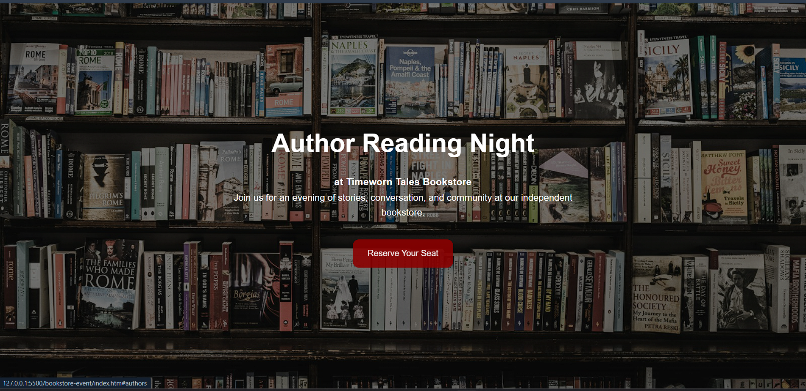
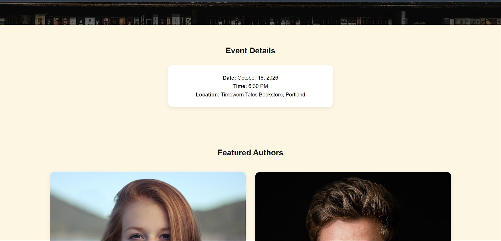
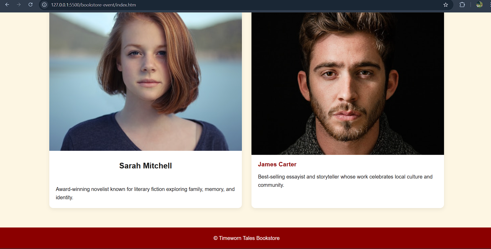

# Portland Author Reading Event Landing Page
* first of all the present details like event and author details are fake, change them immediately on urgent basis******

## landing page screenshots





## Overview

This project is a lightweight, high-performance static landing page created for an independent bookstore in Portland to promote their upcoming Author Reading Event.

The website is built entirely with **HTML5** and **CSS3**, with no external frameworks or JavaScript dependencies, ensuring fast load times, simple maintenance, and excellent compatibility across modern browsers.

---

## Features

### Hero Section

* Full-screen background image
* Vertically and horizontally centered content using CSS Flexbox
* Event headline and call-to-action button
* Responsive layout

### Event Information

* Dedicated section displaying event details
* Clean and readable card-based design

### Author Showcase

* Two-column author bio layout using CSS Grid
* Author images with hover scale animation
* Responsive design for various screen sizes

### Responsive Design

* Mobile-friendly layout
* Grid automatically collapses to a single column on screens smaller than 768px
* Optimized spacing and typography adjustments for mobile devices

### Design System

* CSS custom properties (variables) used as design tokens
* Consistent color palette and spacing system
* Easy customization and future maintenance

---

## Technologies Used

* HTML5
* CSS3

  * CSS Variables
  * Flexbox
  * CSS Grid
  * Media Queries
  * CSS Transitions

---

## Project Structure

```text
bookstore-event/
│
├── index.html
│
└── css/
    └── style.css
```

---

## Design Tokens

The project uses CSS custom properties defined in the `:root` selector.

```css
:root {
    --brand-primary: #8b0000;
    --brand-secondary: #fdf6e3;
}
```

These variables can be modified to quickly update the branding across the entire website.

---

## Requirements Covered

### Phase 1: File Structure

* Created `index.html`
* Created `css/style.css`
* Implemented design tokens using CSS variables

### Phase 2: Hero Section

* Used CSS Flexbox for vertical and horizontal centering
* Added headline and CTA button
* Added full-width background image

### Phase 3: Event Grid

* Implemented CSS Grid with two columns
* Displayed author bios
* Added hover animation using CSS transitions

### Phase 4: Responsiveness

* Added media query at `max-width: 768px`
* Converted author grid to a single-column layout on mobile devices
* No HTML tables used

---

## Getting Started

### Option 1: Open Directly

1. Download or clone the project.
2. Open `index.html` in any modern web browser.

### Option 2: Run with a Local Server

Using VS Code Live Server:

1. Install the Live Server extension.
2. Right-click `index.html`.
3. Select **Open with Live Server**.

---

## Browser Compatibility

Tested and compatible with:

* Google Chrome
* Microsoft Edge
* Mozilla Firefox
* Safari
* Mobile browsers (Android and iOS)

---

## Future Enhancements

Potential improvements for future iterations:

* Event registration form
* Google Maps integration
* Newsletter subscription section
* Author schedule timeline
* Accessibility enhancements
* SEO optimization
* Image optimization using WebP assets

---

## License

This project was created as a pro-bono community initiative for an independent bookstore and is intended for educational and demonstration purposes.
